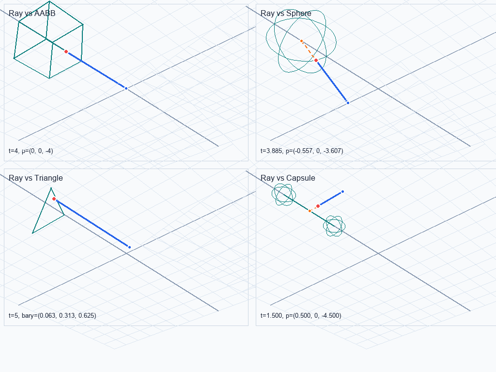

# Mensura Examples

Runnable TypeScript snippets that show the intended API shape. Each file is
self-contained and uses the published entry points (`@exornea/mensura/core`,
`@exornea/mensura/geometry`, `@exornea/mensura/gpu`) so that the same code
works for downstream consumers.

The examples folder is **not** included in `tsc -p tsconfig.json`
(see `tsconfig.json` `include`), so it does not affect library builds. Run a
specific example with `tsx`, `ts-node`, or after `tsc` against
`tsconfig.examples.json` if you add one.

## Files

- [camera-projection.ts](camera-projection.ts): RH view + WebGPU `0..1`
  perspective + frustum-AABB culling + ray-AABB picking.
- [transform-trs.ts](transform-trs.ts): `mat4Compose` / `mat4Decompose`
  roundtrip and `det < 0 -> scale.x` flip behaviour.
- [quaternion-ops.ts](quaternion-ops.ts): `quatFromUnitVectors`,
  `quatConjugate`, `quatSlerp` with the lerp-fallback threshold.
- [error-handling.ts](error-handling.ts): `Result<T>` patterns: `unwrap`,
  discriminated check, error-code switch.
- [batch-and-unsafe.ts](batch-and-unsafe.ts): batch `*IntoMany` over semantic
  Vec3 objects vs `unsafe/*F32Many` over packed `Float32Array` /
  `SharedArrayBuffer`. Rule-of-thumb decision table at the bottom.
- [shared-array-buffer-worker.ts](shared-array-buffer-worker.ts): worker
  handoff over `SharedArrayBuffer` with caller-owned `Atomics` publication.
  Mensura kernels run on shared memory; the host owns synchronization.
- [visual-ray-fixtures.mjs](visual-ray-fixtures.mjs): dependency-free visual
  ray-hit fixtures. `npm run visual:ray` builds the package and writes SVG,
  2D HTML, 3D Canvas HTML, and a regression-tested JSON manifest to
  `.mensura-visual/`.

## Visual Ray Fixture Preview

This checked-in preview mirrors the 3D Canvas output from
`npm run visual:ray`, so package users can understand the expected ray hit
layout before running the generator.

